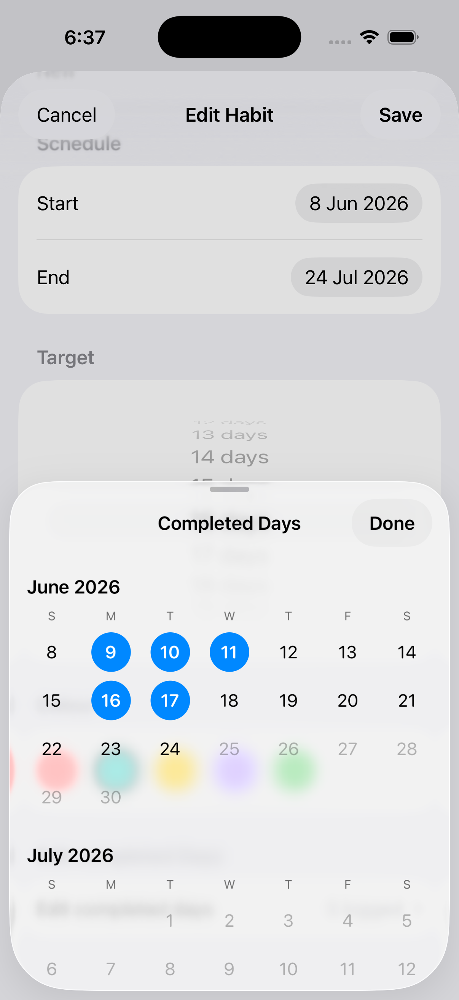

# Pretty Habits

Habits in rings. See upcoming features [here](PRD.md) - checked off TODOs have been implemented!

Visualise daily habits in pretty rings. Check them off to slowly close the rings.

Choose how many times you expect a habit to be done over the period of time - no pressure for everything to be done everyday!

